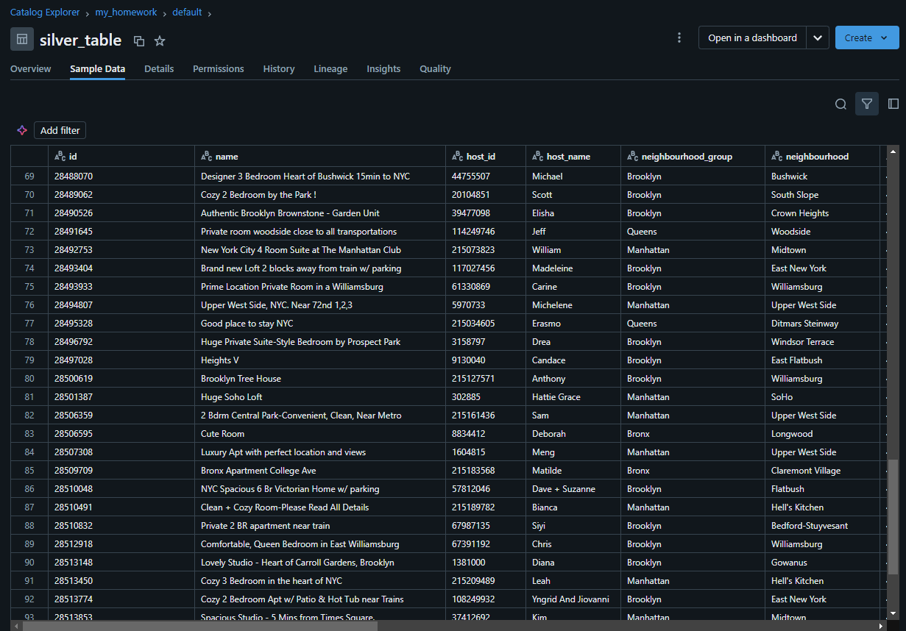

# Databricks homework

This is a Databricks ETL pipeline that automates the process of ingesting and transforming data loaded into catalog volume using Delta Lake, Auto Loader, Structured Streaming and SQL.

To use this worksheet you need to do the following:
1. Set up a Databricks cluster for running the pipeline.
2. Install Delta Lake library (Switch to 'libraries' tab on cluster details page and install `io.delta:delta-core_2.12:2.2.0` using type `Maven`).
3. Create workspace, within the workspace create a volume for storing csv files.
4. Create notebook and copy contents of `HOMEWORK-pyspark.py`.
5. All processed data can be viewed in catalog's delta tables and can be checked by copying and running `HOMEWORK-sql.sql` contents.
6. To set up job for daily ingestion, click _**schedule**_ in top right corner of notebook and specify the schedule params.

### Example of processed and transformed data:

